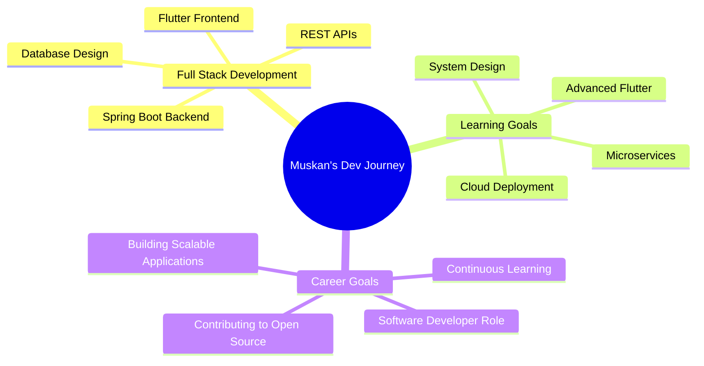

# Hi there! 👋 I'm Muskan Jaiswal

<div align="center">
  
  
  
  
  
</div>

---

## 🚀 About Me

```javascript
const muskan = {
    location: "New Delhi, India 🇮🇳",
    education: "MCA Student (Expected 2026)",
    currentFocus: "Full-Stack Chat Application (Spring Boot + Flutter)",
    availableFor: "Software Development & QA Roles",
    interests: ["Web Development", "API Design", "Problem Solving"],
    lifePhilosophy: "Code, Debug, Learn, Repeat 🔄"
};
```

- 🔭 Currently building: **Full-Stack Chat Application** (Java Spring Boot + Flutter)
- 🌱 Passionate about: **Full-Stack Development, API Testing & Database Design**
- 💼 Previous: **Java Development Intern @ Oasis Infobyte**
- 🎯 Goal: Contributing to innovative projects and continuous learning
- 💬 Ask me about: **Java, Spring Boot, Laravel, PHP, REST APIs**
- 📫 Reach me: **muskanjaiswal981108@gmail.com**
- ⚡ Fun fact: **I love turning complex problems into elegant solutions!**

---

## 🛠️ Tech Arsenal

### 💻 Languages
<p>
  
  
  
  
  
  
  
  
</p>

### 🚀 Frameworks & Technologies
<p>
  
  
  
  
  
  
  
</p>

### 🗄️ Databases
<p>
  
  
</p>

### 🛠️ Tools & Platforms
<p>
  
  
  
  
  
  
  
</p>

---

## 📊 GitHub Analytics

<div align="center">
  
  
  
  
  
</div>

<div align="center">
  
  
  
</div>

---

## 🏆 GitHub Trophies

<div align="center">
  
  
  
</div>

---

## 📈 Contribution Graph

<div align="center">
  
  [](https://github.com/muskanjaiswal2000)
  
</div>

---

## 💼 Featured Projects

<div align="center">

### 🛒 MySara E-Commerce Platform
**Tech Stack:** PHP | Laravel | MySQL | Bootstrap

A full-stack e-commerce solution featuring user authentication, shopping cart functionality, product management, and comprehensive admin panel with CRUD operations. Implemented RESTful APIs and responsive UI using Laravel Eloquent ORM and MVC architecture.

[](https://github.com/muskanjaiswal2000/mysara)

---

### 💼 Personal Portfolio Website
**Tech Stack:** Java | Spring Boot | MongoDB

Dynamic portfolio application with RESTful API endpoints for managing projects, skills, and experience. Features Spring Data MongoDB integration, security configurations, and responsive frontend interface.

---

### 🤖 Live AI Hand Detector
**Tech Stack:** Python | MediaPipe | OpenCV

Real-time webcam-based application featuring hand gesture recognition and handwritten digit detection. Demonstrates computer vision expertise and ML model integration for human-computer interaction systems.

---

### 💬 Full-Stack Chat Application (In Progress)
**Tech Stack:** Java Spring Boot | Flutter | MongoDB

Currently developing a real-time chat application with modern UI, message encryption, and cross-platform support. Features include user authentication, real-time messaging, and media sharing capabilities.

</div>

---

## 🎓 Certifications & Learning

<div align="center">


</div>

---

## 🌐 Connect With Me

<div align="center">
  
  [](https://www.linkedin.com/in/muskan-jaiswal12/)
  [](https://github.com/muskanjaiswal2000)
  [](mailto:muskanjaiswal981108@gmail.com)
  
</div>

---

## 💡 Random Dev Quote

<div align="center">
  
  
  
</div>

---

## 📌 Pinned Repositories

<div align="center">
  
  [](https://github.com/muskanjaiswal2000/mysara)
  [](https://github.com/muskanjaiswal2000/To-Do-Web-App)
  
  [](https://github.com/muskanjaiswal2000/Calculator)
  [](https://github.com/muskanjaiswal2000/ATM-Interface)
  
</div>

---

## 🎯 Current Focus



---

## 💪 Key Strengths

<div align="center">

| 🚀 Immediate Availability | 🧠 Problem Solving | 🤝 Team Collaboration |
|:---:|:---:|:---:|
| Ready to join immediately with flexibility to relocate | Strong analytical and debugging skills | Effective communication and agile mindset |

| 💻 Full-Stack Expertise | 📚 Continuous Learning | 🎯 Quality Focused |
|:---:|:---:|:---:|
| Java, PHP, Laravel, Spring Boot proficiency | Constantly exploring new technologies | API testing and code quality advocate |

</div>

---

<div align="center">
  
  ### 💼 Open to Opportunities
  
  
  
  
  
</div>

---

<div align="center">
  
  ### ⭐ Show some love by starring my repositories!
  
  
  
  <sub>Made with ❤️ by Muskan Jaiswal</sub>
  
</div>
